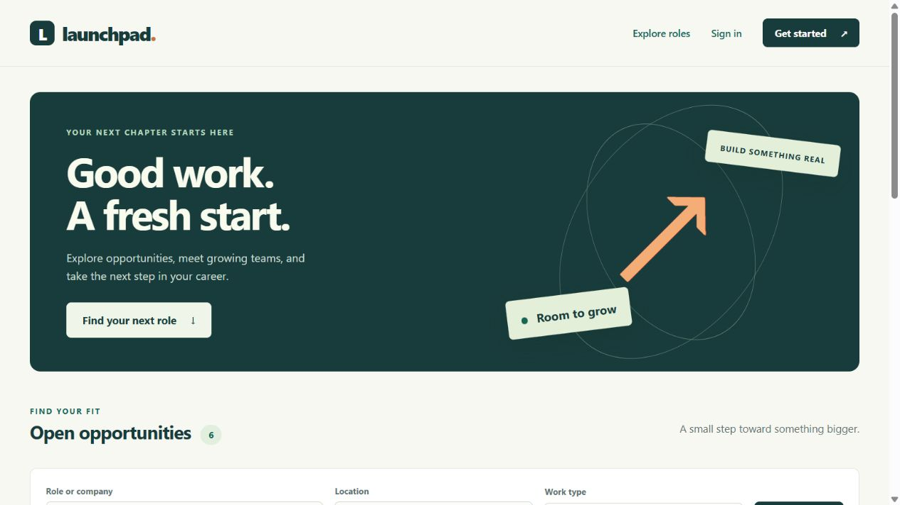

# Job Portal Web Application — Launchpad

A small, working Django + MySQL job portal with HTML templates, CSS and vanilla JavaScript. Candidates browse opportunities and apply; employers manage their own company, jobs and applicants. Built with AI assistance on 27 September 2026 as current personal portfolio work. This is not evidence of earlier employment, real recruitment activity or production deployment.



## Features

- Candidate/employer registration, password hashing, login and POST logout.
- Company profile and employer-owned job create/read/update/delete.
- Keyword, location and employment-type search; six jobs per page.
- Candidate applications with cover letters and private application dashboards.
- Employer applicant lists and status changes for jobs they own.
- Duplicate-application constraints, salary/deadline validation, CSRF protection and escaped user content.
- Repeatable sample data and 20 automated tests.

There is one company per employer account. No file upload, email verification, password-reset email, chat, payment, recommendation engine or real vacancy feed is included. Job deletion also deletes its applications; closing a job instead preserves history. The sample salary ranges are annual INR figures, not verified market salaries.

## Setup on Windows

Requirements: Python 3.12 recommended (tested), MySQL 8.4 recommended (8.0.16+ minimum), and Git. Run commands from this project folder. The shared environment in [the starting guide](../PORTFOLIO_START_HERE.md) can also be used.

```powershell
py -3.12 -m venv .venv
.\.venv\Scripts\python.exe -m pip install -r requirements.txt
Copy-Item .env.example .env
```

On macOS/Linux:

```bash
python3 -m venv .venv
source .venv/bin/activate
python -m pip install -r requirements.txt
cp .env.example .env
```

On Linux, building `mysqlclient` may need `python3-dev default-libmysqlclient-dev build-essential pkg-config`. On macOS see the [driver's official installation guide](https://github.com/PyMySQL/mysqlclient#install). A Windows Python 3.12 wheel was used in verification.

### Create the database

Start MySQL. Log in with an administrator account using `mysql -u root -p`, then run the SQL after replacing the example password:

```sql
CREATE DATABASE IF NOT EXISTS job_portal CHARACTER SET utf8mb4 COLLATE utf8mb4_unicode_ci;
CREATE USER IF NOT EXISTS 'portfolio'@'localhost' IDENTIFIED BY 'choose-a-local-password';
GRANT ALL PRIVILEGES ON job_portal.* TO 'portfolio'@'localhost';
-- Django creates/drops this separate database when running tests:
GRANT ALL PRIVILEGES ON test_job_portal.* TO 'portfolio'@'localhost';
```

If `portfolio` already exists, the statement preserves its existing password. Use that password in `.env`. The optional root Docker setup already provides databases and grants; its host port is 3307 instead of 3306.

Edit `.env`: set `MYSQL_PASSWORD` and generate your own `DJANGO_SECRET_KEY`. Keep `DATABASE_ENGINE=mysql`, `MYSQL_DATABASE=job_portal`, and `DJANGO_DEBUG=true` for local demonstration. Generate a key:

```powershell
.\.venv\Scripts\python.exe -c "from django.core.management.utils import get_random_secret_key; print(get_random_secret_key())"
```

Paste the generated value into `.env`, preferably inside single quotes. Environment variables already set in the terminal override `.env`. Never commit this file. The example values are placeholders, not real credentials.

### Migrate, seed and run

```powershell
.\.venv\Scripts\python.exe manage.py migrate
.\.venv\Scripts\python.exe manage.py seed_demo
.\.venv\Scripts\python.exe manage.py runserver 127.0.0.1:8011
```

On an activated Linux/macOS environment, replace `.\.venv\Scripts\python.exe` with `python`. Open [Launchpad locally](http://127.0.0.1:8011/). Stop the server with Ctrl+C.

| Demo account | Role | Local sample password |
|---|---|---|
| `demo_candidate` | Candidate | `LocalDemo!2026` |
| `demo_employer` | Employer at Northstar Labs | `LocalDemo!2026` |
| `demo_employer_two` | Employer at Bloom Digital | `LocalDemo!2026` |

These are public synthetic demo credentials, suitable only for local sample data. The seed creates three accounts, two companies, six roles and one reviewed application. Re-running it preserves existing records/passwords. `seed_demo --reset-passwords` explicitly resets only the reserved demo accounts. Demo job deadlines are 45 days after the first seed; seeding later does not reopen jobs you closed or refresh old deadlines. Edit the job while signed in as its employer when needed.

For admin access, `python manage.py createsuperuser` creates a separate trusted administrator. Regular registration cannot create staff accounts. A superuser without a candidate/employer Profile uses `/admin/`, not the portal dashboard. Employer Profiles need a linked Company; normal registration creates both atomically.

### Optional SQLite demonstration

Set `DATABASE_ENGINE=sqlite` in `.env`, then run the same migration, seed and server commands. It creates `db.sqlite3`, which Git ignores. This is a separate database with separate accounts/data; switching engines does not transfer data. MySQL remains the resume project's main database.

## Tests

```powershell
.\.venv\Scripts\python.exe manage.py check
.\.venv\Scripts\python.exe manage.py makemigrations --check --dry-run
.\.venv\Scripts\python.exe manage.py test jobs --noinput
```

Tests cover registration and hashed passwords, roles, ownership, CRUD, combined filters, deadlines, salary ranges, duplicate applications, privacy, status changes, CSRF, escaping and seed repeatability. The same 20 tests were run with MySQL and SQLite. Django creates a disposable `test_job_portal` database on MySQL; never configure a real business database as a test database.

## Files to learn first

| File | Purpose |
|---|---|
| `config/settings.py` | Environment, database, middleware and Django configuration |
| `config/urls.py`, `jobs/urls.py` | Map URL paths to views |
| `jobs/models.py` | Profile, Company, Job, Application and constraints |
| `jobs/forms.py` | Registration and model-backed input validation |
| `jobs/permissions.py` | Login and candidate/employer role checks |
| `jobs/views.py` | Request handling and ownership-filtered queries |
| `templates/` | Server-rendered HTML and CSRF-protected forms |
| `static/jobs/style.css`, `app.js` | Responsive layout, company-field visibility and letter counter |
| `jobs/migrations/` | Versioned database schema |
| `jobs/management/commands/seed_demo.py` | Fictional sample data |
| `jobs/tests.py` | Executable behavior and regression checks |

See [INTERVIEW.md](INTERVIEW.md) for the schema, request flows, CRUD mapping and honest answers; follow [DEMO.md](DEMO.md) for a short presentation.

## Common setup problems

- **No module named django/MySQLdb:** use the Python executable from the environment where requirements were installed.
- **Access denied / connection refused:** check server status, database/user grants, password, host and port. Driver installation alone does not start MySQL.
- **Missing table:** run `migrate` against the selected engine and database.
- **Secret key error:** copy/edit `.env` and set `DJANGO_SECRET_KEY`.
- **Unstyled page:** local static serving requires `DJANGO_DEBUG=true`; restart after changing settings.
- **403:** wrong account role or missing CSRF token. Do not disable the protection to hide the error.
- **404 editing another employer's job:** expected ownership enforcement.
- **No visible jobs after weeks:** seeded deadlines may have expired; the owner can edit the dates.

This is a local development application. Production work would require HTTPS, secure cookie settings, secret management, a proper application/static server, backups, login abuse protection and more operational testing. Those are not implemented deployment claims.
