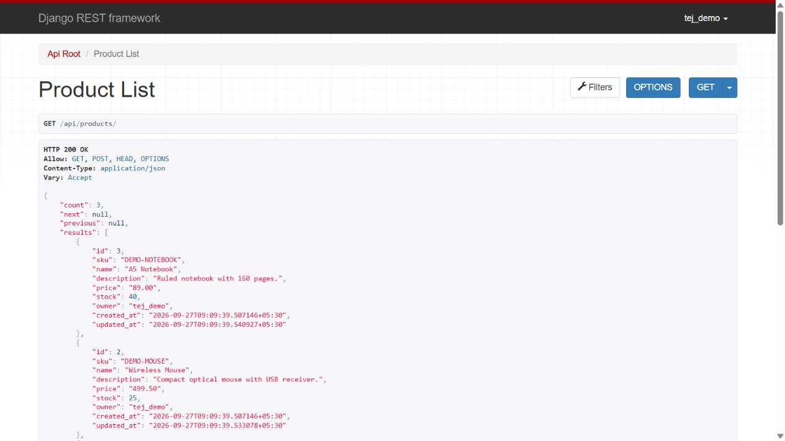

# RESTful Product API

A small Python + Django REST Framework + MySQL portfolio project. An authenticated user can create, view, edit, search and delete their own products. It is being completed in September 2026 for interview preparation, with AI assistance, and is not a claim of prior employment or production experience.



## What works

- Token authentication for API clients; session login for DRF's browsable interface.
- Product CRUD, owner isolation, unique SKU, nonnegative decimal prices and integer stock.
- Search by name/SKU/description, ordering, and pagination (10 results per page).
- Database migrations, three repeatable sample products, and automated API tests.
- Django admin for trusted staff. Admin access intentionally allows staff to manage all products; ordinary API accounts remain owner-restricted.

This project is intentionally small: one Django app, one model, one serializer and one viewset. No public registration, shopping cart, payment, category system or deployment is included. Prices in the sample data represent INR by convention; there is no currency conversion.

## Requirements

Python 3.11+ (64-bit Python 3.12 recommended), MySQL 8.0.16+ (8.4 recommended), and Git. MySQL 8.0.16 or later is required here so database CHECK constraints are enforced. Direct dependency versions are pinned in `requirements.txt`. MySQL must be running before migration or startup.

## 1. Install Python dependencies

From this directory, Windows PowerShell:

```powershell
py -m venv .venv
.\.venv\Scripts\python.exe -m pip install --upgrade pip
.\.venv\Scripts\python.exe -m pip install -r requirements.txt
Copy-Item .env.example .env
```

Linux/macOS:

```bash
python3 -m venv .venv
source .venv/bin/activate
python -m pip install --upgrade pip
python -m pip install -r requirements.txt
cp .env.example .env
```

On Debian/Ubuntu, a source build of `mysqlclient` may first need `sudo apt install python3-dev default-libmysqlclient-dev build-essential pkg-config`. On macOS it may need `brew install mysql-client pkg-config` and `export PKG_CONFIG_PATH="$(brew --prefix mysql-client)/lib/pkgconfig"`. On Windows, use a Python version with a compatible prebuilt wheel; a source build requires native development tools.

## 2. Create a MySQL database

Log into your local MySQL administrator account (`mysql -u root -p`) and run this SQL after replacing the example password. Django creates the tables through migrations; do not manually create product tables.

```sql
CREATE DATABASE IF NOT EXISTS product_api CHARACTER SET utf8mb4 COLLATE utf8mb4_unicode_ci;
CREATE USER IF NOT EXISTS 'portfolio'@'localhost' IDENTIFIED BY 'replace-with-a-local-password';
GRANT ALL PRIVILEGES ON product_api.* TO 'portfolio'@'localhost';
-- Only needed to run the automated suite: Django creates a separate test database.
GRANT ALL PRIVILEGES ON test_product_api.* TO 'portfolio'@'localhost';
```

If `portfolio` already exists, `CREATE USER IF NOT EXISTS` preserves its existing password; use that password in `.env`. The grants are for the development database and its test database, not global administrator access. A server configured to match a different client host may need the corresponding local user/host account.

Edit `.env`:

```dotenv
DATABASE_ENGINE=mysql
MYSQL_DATABASE=product_api
MYSQL_USER=portfolio
MYSQL_PASSWORD=your-local-password
MYSQL_HOST=127.0.0.1
MYSQL_PORT=3306
DJANGO_SECRET_KEY=your-long-random-secret
DJANGO_DEBUG=True
DJANGO_ALLOWED_HOSTS=localhost,127.0.0.1,[::1]
```

Generate a secret with `.venv\Scripts\python.exe -c "from django.core.management.utils import get_random_secret_key; print(get_random_secret_key())"` (Linux/macOS: `python -c ...`). Keep `.env` private. Existing shell environment variables override `.env`.

### Optional SQLite demo

If MySQL is temporarily unavailable, explicitly set `DATABASE_ENGINE=sqlite` in `.env`. This creates `db.sqlite3`; it does not test MySQL connectivity. All other setup commands stay the same. SQLite and MySQL store separate data, so migrate and seed again after switching. Do not describe a SQLite-only demo as MySQL-tested.

## 3. Migrate, seed and run

Windows PowerShell:

```powershell
.\.venv\Scripts\python.exe manage.py migrate
.\.venv\Scripts\python.exe manage.py seed_demo --password 'PortfolioDemo!2026'
.\.venv\Scripts\python.exe manage.py runserver 127.0.0.1:8002
```

Linux/macOS with the virtual environment activated:

```bash
python manage.py migrate
python manage.py seed_demo --password 'PortfolioDemo!2026'
python manage.py runserver 127.0.0.1:8002
```

Open <http://127.0.0.1:8002/api/> and use **Log in** with `tej_demo` / `PortfolioDemo!2026` to browse products. The password above is public demonstration data; use it only for a local sample account. Choose your own password if you prefer and substitute it in the examples. The seed command never prints passwords or tokens.

`seed_demo` can be repeated without `--password` after the user exists. It restores the three sample rows from `sample_data/products.json`, preserves the existing password and leaves unrelated products alone. It refuses to transfer sample SKUs owned by another account. Avoid running it on data you have edited and want to preserve. For another account, use `python manage.py createsuperuser` or Django admin; no public registration endpoint is provided. `python manage.py changepassword tej_demo` changes the demo password.

## API endpoints

Use trailing slashes. JSON requests need `Content-Type: application/json`. Every product endpoint needs `Authorization: Token YOUR_TOKEN` or an authenticated browser session.

| Method | URL | Result |
| --- | --- | --- |
| POST | `/api/auth/token/` | Username/password -> token (200; invalid credentials 400) |
| GET | `/api/products/` | Your products, paginated (200) |
| POST | `/api/products/` | Create your product (201) |
| GET | `/api/products/{id}/` | Read your product (200) |
| PUT | `/api/products/{id}/` | Update all required writable fields (200) |
| PATCH | `/api/products/{id}/` | Update supplied fields (200) |
| DELETE | `/api/products/{id}/` | Delete your product (204, empty body) |

Examples: `/api/products/?search=mouse`, `/api/products/?ordering=price`, `/api/products/?ordering=-stock`, `/api/products/?page=2`. Pagination returns `count`, `next`, `previous` and `results`. A nonexistent page returns 404. Default ordering is newest first. Owner data is filtered before searching and pagination.

Write fields: `sku`, `name`, `description`, `price`, `stock`. `sku`, `name`, `price` are required on POST/PUT; description defaults to empty and stock to zero on creation. PUT does not clear omitted optional values on an existing record. `id`, `owner`, `created_at`, `updated_at` are read-only. SKU is globally unique, 1-32 uppercase letters/digits/underscores/hyphens and starts with a letter or digit. Price ranges from `0.00` to `99999999.99`; stock ranges from 0 to 2147483647. Name is 1-120 nonblank characters; description is at most 2000 characters.

### PowerShell example

In a second terminal:

```powershell
$baseUrl = 'http://127.0.0.1:8002'
$loginBody = @{ username = 'tej_demo'; password = 'PortfolioDemo!2026' } | ConvertTo-Json
$login = Invoke-RestMethod -Uri "$baseUrl/api/auth/token/" -Method Post -ContentType 'application/json' -Body $loginBody
$headers = @{ Authorization = "Token $($login.token)" }
Invoke-RestMethod -Uri "$baseUrl/api/products/" -Headers $headers
$body = @{ sku = 'DEMO-HEADSET'; name = 'USB Headset'; description = 'Interview demonstration'; price = '1299.00'; stock = 5 } | ConvertTo-Json
$product = Invoke-RestMethod -Uri "$baseUrl/api/products/" -Method Post -Headers $headers -ContentType 'application/json' -Body $body
Invoke-RestMethod -Uri "$baseUrl/api/products/$($product.id)/" -Method Patch -Headers $headers -ContentType 'application/json' -Body '{"stock":4}'
Invoke-RestMethod -Uri "$baseUrl/api/products/$($product.id)/" -Method Delete -Headers $headers
```

### curl example (Bash)

```bash
curl -X POST http://127.0.0.1:8002/api/auth/token/ \
  -H 'Content-Type: application/json' \
  -d '{"username":"tej_demo","password":"PortfolioDemo!2026"}'
# Copy the returned token locally; do not paste it into GitHub or screenshots.
TOKEN='paste-your-token-here'
curl http://127.0.0.1:8002/api/products/ -H "Authorization: Token $TOKEN"
curl -X POST http://127.0.0.1:8002/api/products/ \
  -H "Authorization: Token $TOKEN" -H 'Content-Type: application/json' \
  -d '{"sku":"DEMO-HEADSET","name":"USB Headset","price":"1299.00","stock":5}'
# Replace 4 below with the actual id returned by POST.
curl -X PATCH http://127.0.0.1:8002/api/products/4/ \
  -H "Authorization: Token $TOKEN" -H 'Content-Type: application/json' -d '{"stock":4}'
curl -X DELETE http://127.0.0.1:8002/api/products/4/ -H "Authorization: Token $TOKEN"
```

Do not repeat POST with the same SKU unless testing the duplicate validation response. The examples delete their created item so they can be repeated.

## Tests and checks

```powershell
.\.venv\Scripts\python.exe manage.py check
.\.venv\Scripts\python.exe manage.py makemigrations --check --dry-run
.\.venv\Scripts\python.exe manage.py test
```

Linux/macOS: replace `.\.venv\Scripts\python.exe` with `python`. With MySQL selected, the suite needs permission to create/drop `test_product_api`; it does not clear the development database. Check `MYSQL_DATABASE` before running tests against any shared server.

The tests exercise actual HTTP-style API calls and verify database state: all CRUD operations, token login failures, anonymous/other-user access, owner spoofing, blank/negative/duplicate/oversized input, filtering, pagination and repeatable seed behavior. See `INTERVIEW.md` for how to explain these choices, and `DEMO.md` for a five-minute demonstration.

Verified during portfolio creation on 27 September 2026: all 24 tests passed on both SQLite and an actual MySQL 8.4.10 server; Django system checks and migration drift checks passed. Two consecutive seed runs on MySQL produced exactly three sample products. These are local development checks, not production or load-test results. Run the commands yourself before an interview so you can explain your own results.

## Main files

```text
config/settings.py          Environment, database, authentication, pagination
config/urls.py              Endpoint routing and browsable API login
products/models.py          Product schema and database constraints
products/serializers.py     JSON fields and input validation
products/views.py           Owner filtering, saving and token endpoint
products/migrations/        Version-controlled schema creation
products/management/commands/seed_demo.py
products/tests/test_api.py   CRUD, authorization and validation tests
sample_data/products.json   Three fictional local sample products
```

## Common setup problems

| Problem | Fix |
| --- | --- |
| MySQL connection refused | Start MySQL and check host/port; a service on another port requires changing `.env`. |
| Access denied / unknown database | Check the database, password and matching MySQL user/host account. |
| `No module named MySQLdb` | Install requirements using the same Python executable used to run Django. |
| No such table / table does not exist | Run `migrate` against the selected database. |
| 401 with a token | Use `Token`, not `Bearer`; verify the account is active and token is from this database. |
| 403 in the browser | Session writes need CSRF; use the browsable form or use a token client. |
| 404 for a valid id | That product may belong to another user; API ownership isolation deliberately hides it. |
| Duplicate SKU on POST | Use another SKU or update the existing product with PATCH. |
| Test database permission error | Grant privileges on `test_product_api.*` to the local test account. |

## Limits and next improvements

This is a local portfolio application. DRF tokens do not expire automatically, and a password change does not automatically revoke existing tokens. An administrator can delete a token in Django admin to revoke it. Browsable API **Log out** only ends the browser session; it does not revoke API tokens. Token login has a basic per-process cache throttle (10/minute), which resets on restart and is not a production abuse-control system.

Before a real deployment, add HTTPS, secret management, production hosting/static settings, deployment checks, token lifetime/revocation policy, shared rate limiting, audit logs and backups. Stock is a manually editable count; concurrent PATCH requests use last-write-wins and this API is not an order/reservation system. Keep the current architecture understandable before adding those features.

Framework references: [DRF serializers](https://www.django-rest-framework.org/api-guide/serializers/) and [DRF permissions](https://www.django-rest-framework.org/api-guide/permissions/).
